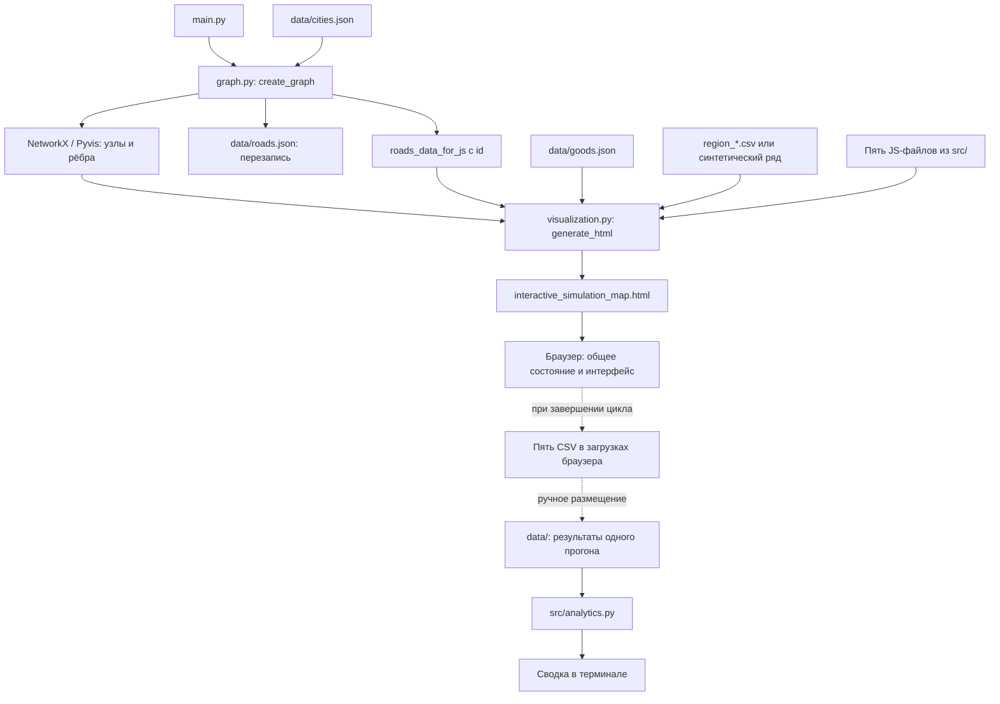

# Архитектура и зависимости

[На главную](../README.md)

## Поток данных



Стрелка выгрузки показывает предусмотренный в коде путь. Сейчас выполнение часового шага прерывается на отсутствующей функции логистики; см. [ограничения](KNOWN_ISSUES.md).

## Ответственность модулей

| Модуль | Основные элементы | Фактическая роль |
| --- | --- | --- |
| [`graph.py`](../Analitics/1/Arcanomics/src/graph.py) | `get_region_cities`, `calculate_distance`, `create_graph` | Выбор городов, региональные центры, дороги, визуальные атрибуты |
| [`visualization.py`](../Analitics/1/Arcanomics/src/visualization.py) | `SCRIPT_FILES`, `generate_html` | Чтение JS и погоды, подстановка данных, панели управления и фильтр карты |
| [`init.js`](../Analitics/1/Arcanomics/src/init.js) | `ExperimentConfig`, `seededRandom`, `initializeCitySimulations` | Общие переменные, начальные товары, специализации и подсказки |
| [`weather.js`](../Analitics/1/Arcanomics/src/weather.js) | `EventSystem` | Глобальная сводка, местная погода и коэффициенты |
| [`economy.js`](../Analitics/1/Arcanomics/src/economy.js) | `PricingModels`, `updateCityEconomy` | Почасовой баланс товаров, цены и журнал города |
| [`logistics.js`](../Analitics/1/Arcanomics/src/logistics.js) | Те же определения, что в `simulation.js` | Сейчас точная копия координатора; самостоятельной реализации логистики нет |
| [`simulation.js`](../Analitics/1/Arcanomics/src/simulation.js) | `startSimulation`, `runSimulationHour`, `downloadSimulationResults` | Таймер, порядок расчётов, панели, графики и CSV |
| [`analytics.py`](../Analitics/1/Arcanomics/src/analytics.py) | `run_full_analytics` | Отдельный анализ сохранённых CSV через pandas/NumPy |

## Python и браузер

Python работает на этапе генерации. NetworkX хранит неориентированный граф для построения связей, Pyvis создаёт страницу для vis-network. Python не обслуживает часовые шаги и не принимает результаты обратно.

В браузере Pyvis предоставляет глобальные `nodes`, `edges`, `network`. Генератор объединяет скрипты строго в порядке:

```text
init.js → weather.js → economy.js → logistics.js → simulation.js
```

Это обычные скрипты в общей глобальной области, без ES-модулей и сборщика. `__ROAD_DATA__`, `__GOODS_DATA__`, `__WEATHER_HISTORY_DATA__` заменяются JSON при генерации. Подключение `init.js` отдельно без этой подстановки не является штатным запуском.

После внедрения скриптов добавляется обработчик фильтра регионов. Он меняет `hidden` у узлов и рёбер, но не удаляет города из `citySimulations` и дороги из `roadNetwork`.

## Владение состоянием

| Объект | Содержимое |
| --- | --- |
| `ExperimentConfig` | Идентификатор прогона, модель, сценарий, seed и длительность |
| `citySimulations` | Население, специализация, товары, локальная погода по идентификатору города |
| `roadNetwork` | Массив дорог, переданный генератором |
| `EventSystem` | Глобальное событие, локальные ограничения погоды и массив истории |
| `cityHourLogs` | Почасовые записи по паре город–товар |
| `roadHourLogs` | Массив для истории маршрутов; заполнение в текущих модулях отсутствует |
| `simulationLogRows`, `priceHistoryRows` | Суточные записи в 23:00 |
| `chartsHistory` | До 120 последних часовых точек графиков |

Состояние существует в памяти страницы. Перезагрузка создаёт его заново. Браузерные загрузки CSV и ручное размещение файлов для аналитики — граница между вычислением и долговременным хранением.
