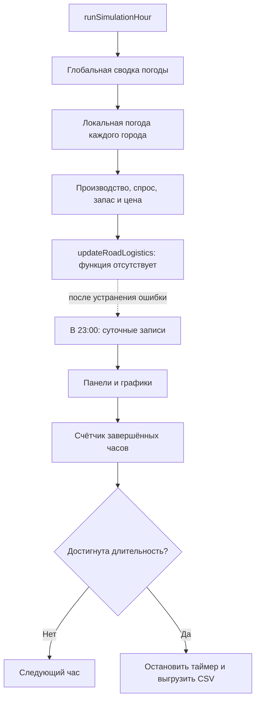

# Логика симуляции

[На главную](../README.md) · [Архитектура](ARCHITECTURE.md) · [Данные](DATA.md)

Здесь описаны вычисления текущих исходников. Полный часовой цикл сейчас не завершается из-за отсутствующей функции логистики. Формулы экономики и порядок вызовов можно изучать независимо от этого ограничения.

## Начальное состояние

[`init.js`](../Analitics/1/Arcanomics/src/init.js) задаёт `ExperimentConfig`:

| Поле | Значение по умолчанию | Назначение |
| --- | --- | --- |
| `run_id` | `null` до старта | При старте: `run_<Date.now()>_seed<seed>` |
| `model` | `market` | Активная модель цены |
| `scenario` | `baseline` | Метка для журналов; отдельного переключателя сценариев нет |
| `seed` | `123456789` | Начальное состояние генератора случайных чисел |
| `duration_days` | `30` | Число моделируемых суток |

Генератор случайных чисел: `state = (state * 1664525 + 1013904223) >>> 0`, результат `state / 4294967296`. Он используется при инициализации. `run_id` зависит от времени запуска и не повторяется вместе с seed.

На загрузке страницы каждый город получает копию `goods.json`, население из узла графа и специализацию. Подсказки заполняются без экономического шага.

| Диапазон случайного числа | Специализация | Особые стартовые значения |
| --- | --- | --- |
| `[0; 0,35)` | Agri-cluster | A: запас 120, базовая цена 25 |
| `[0,35; 0,60)` | Industry | B: запас 120, базовая цена 20 |
| `[0,60; 0,80)` | Extraction | C: запас 120, базовая цена 15 |
| `[0,80; 1)` | Trade Hub | A/B/C: запас 20; базовые цены 55/45/35 |

При изменении базовой цены `setProductBasePrice()` одновременно задаёт `base_price`, `current_price` и `last_price`. Остальные товары берут значения шаблона.

## Игровое время и порядок шага

Изначально: день 1, 06:00:00. После нажатия `Start` один часовой расчёт выполняется сразу. Затем таймер каждые 500 мс добавляет 20 игровых минут; экономика вызывается при переходе к целому часу. Остановка предусмотрена после `duration_days * 24` часовых вызовов.



`cityHourLogs` фиксирует экономику до вызова логистики. Суточные средние цены фиксируются в 23:00, а не усредняются по всем часам суток. Из-за старта в 06:00 `N * 24` шагов охватывают части `N + 1` календарных дней.

## Производство и баланс товара

Базовая производительность измеряется в единицах товара за игровой час:

| Специализация | Commodity A | Commodity B | Commodity C |
| --- | ---: | ---: | ---: |
| Agri-cluster | 24 | 1,2 | 1,2 |
| Industry | 1,2 | 21 | 1,2 |
| Extraction | 1,2 | 1,2 | 18 |
| Trade Hub | 15 | 12 | 0 |
| Прочая специализация | 3 | 3 | 3 |

Спрос равен 9,6 ед./ч для каждого товара; у Trade Hub спрос на C равен 19,2 ед./ч. Население в текущей формуле спроса не участвует.

Для каждого товара [`updateCityEconomy()`](../Analitics/1/Arcanomics/src/economy.js) вычисляет:

```text
production = baseProduction * weather.productionMultiplier
availableForSale = previousStock + production
fulfilledDemand = min(demand, availableForSale)
unmetDemand = max(0, demand - fulfilledDemand)
stock = availableForSale - fulfilledDemand
```

`unmetDemand` измеряет фактический неудовлетворённый спрос; высокая цена сама по себе его не доказывает.

## Три модели цены

Обозначения: `B` — базовая цена, `D` — спрос, `P` — производство, `A` — доступное к продаже количество, `S` — запас после продажи, `L` — предыдущая инерционная цена. `clamp(x, lo, hi)` ограничивает значение интервалом.

| Модель | Цена до погодного множителя |
| --- | --- |
| `market` | `B * clamp(D / A, 0.3, 3.5)`; при `A = 0` используется коэффициент `3.5` |
| `linear` | `clamp(B + 1.5 * (D - P) - 0.2 * S, 0.4 * B, 120)` |
| `inertia` | `clamp(L + 0.8 * (D - P) - 0.1 * S, 0.4 * B, 120)` |

Затем результат умножается на `weather.priceMultiplier` и записывается в `current_price`. Поэтому итоговая цена может выйти за ограничение, применённое **до** погодного множителя. Только модель `inertia` обновляет `last_price` вычисленной итоговой ценой.

## Погода

[`visualization.py`](../Analitics/1/Arcanomics/src/visualization.py) формирует ряды по `region_a`–`region_d`. При отсутствии ожидаемого CSV используется 1000 записей: `temp = 12 + i % 10`, `rain = 0`, `snow = 0`, `wind = 15`.

`EventSystem.getCityWeatherState()` выбирает регион города и запись по индексу `((day - 1) * 24 + hour) % length`. К ней добавляются детерминированные сдвиги по имени города и суточная синусоида температуры. Поэтому даже одинаковый базовый ряд даёт разную локальную погоду.

До применения локального периода затишья условия проверяются в таком порядке:

| Событие | Условие локальной погоды | Производство | Скорость транспорта | Стоимость транспорта | Цена |
| --- | --- | ---: | ---: | ---: | ---: |
| Шторм | `snow > 0.1` или `wind > 20` | 0,60 | 0,50 | 1,40 | 1,15 |
| Ливень | `rain > 0.2` | 0,85 | 0,70 | 1,25 | 1,05 |
| Заморозки | `temp < 7` | 0,65 | 0,90 | 1,10 | 1,25 |
| Засуха | `temp > 23` и `rain === 0` | 0,70 | 1,00 | 1,00 | 1,20 |
| Ясно / `harvest` | Иначе | 1,25 | 1,00 | 1,00 | 0,90 |

При переходе от благоприятного базового состояния к неблагоприятному код устанавливает `cooldownEndDay = day + 2`. В следующих обращениях до этой даты неблагоприятное событие может заменяться на `harvest`. Метод меняет `cityCooldowns`, поэтому повторные вызовы для одного часа не являются чистым чтением состояния.

Глобальная `advanceToDay()` берёт первый доступный регион ряда и использует другие пороги. Её сводка попадает в суточные CSV; экономика использует локальную погоду каждого города. Глобальную запись нельзя трактовать как погоду всех городов.

Массив `EventSystem.definitions` содержит также `fog` и `fire`, но текущий путь выбора локального события не использует этот каталог. Транспортные коэффициенты вычисляются, однако их применение в текущих модулях заблокировано отсутствующей логистикой.

## Повторные эксперименты

Для сравнения моделей используйте свежую загрузку страницы с одинаковыми исходными данными и seed, затем выберите модель до запуска. `startSimulation()` очищает журналы, но не переинициализирует города, часы, генератор случайных чисел, графики и `cityCooldowns`. Выбор модели и длительности также остаётся доступен во время работы. Подробные последствия: [ограничения](KNOWN_ISSUES.md).
