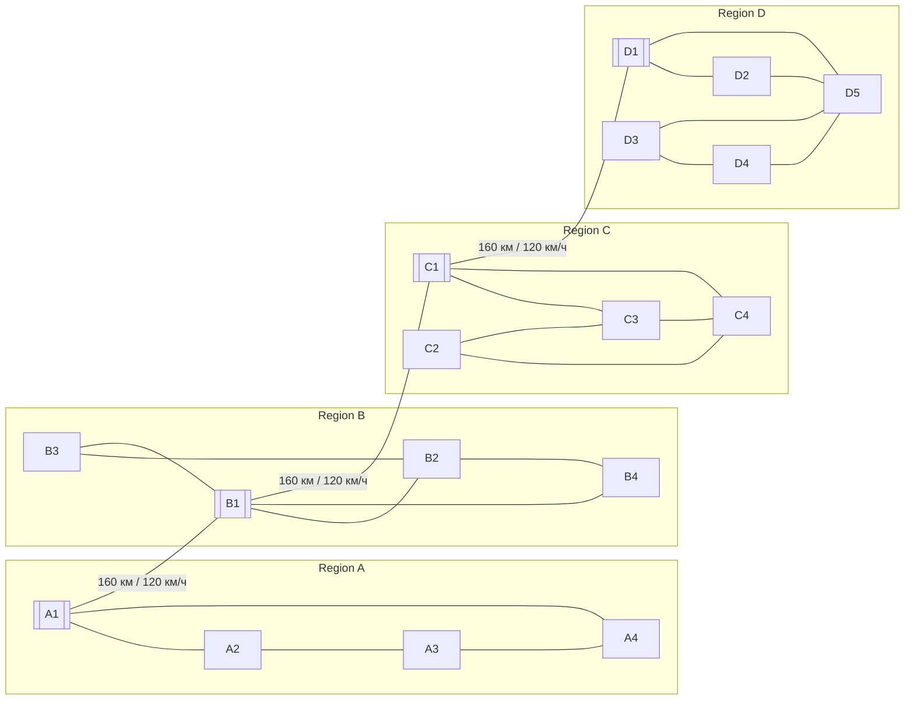

# Топология городской сети

[На главную](../README.md) · [Архитектура](ARCHITECTURE.md)

Источник алгоритма: [`src/graph.py`](../Analitics/1/Arcanomics/src/graph.py). Источник городов: [`data/cities.json`](../Analitics/1/Arcanomics/data/cities.json). Схема ниже относится к текущему генератору с настройками по умолчанию, а не к исторической HTML-карте.

## Как строится граф

1. По умолчанию выбираются регионы в порядке `region_a`, `region_b`, `region_c`, `region_d`. При передаче `selected_regions` имена нормализуются, повторы удаляются с сохранением порядка.
2. Из каждого региона берутся первые пять записей максимум. Если регион отсутствует или справочник не удалось прочитать, генерируется до пяти процедурных городов.
3. Региональным центром становится город с наибольшим населением среди выбранных записей.
4. Каждый город соединяется с двумя ближайшими городами своего региона по расстоянию гаверсинусов, округлённому до 0,1 км. Уже существующие связи не дублируются; граф неориентированный. Внутренняя скорость — 90 км/ч.
5. Центры соседних в списке регионов соединяются цепочкой. Каждому такому коридору задаётся условная длина 160 км и скорость 120 км/ч.
6. Дороги сохраняются в `roads.json`. При передаче в JavaScript им дополнительно назначаются `id` вида `edge_0`.

Две ближайшие связи на город не означают степень ровно два: другие города тоже могут выбрать его соседом. Это не полный граф и не алгоритм кратчайших торговых маршрутов. Для произвольных входных городов правило двух соседей не гарантирует связности внутри региона; для текущего набора вся сеть связна.

## Текущий состав

| Регион | Записей в JSON | Городов в графе | Внутренних дорог | Центр |
| --- | ---: | ---: | ---: | --- |
| A | 4 | 4 | 4 | Region A · Hub 1 |
| B | 4 | 4 | 5 | Region B · Hub 1 |
| C | 4 | 4 | 5 | Region C · Hub 1 |
| D | 6 | 5 | 6 | Region D · Hub 1 |
| Всего | 18 | 17 | 20 | Плюс 3 межрегиональных коридора |

`Region D · Hub 6` не попадает в граф из-за `max_cities=5`. Всего получается 17 узлов, 23 ребра, одна компонента связности.

## Все связи по умолчанию

В схеме `A1` означает `Region A · Hub 1`, аналогично для остальных узлов. Выделенные двойной рамкой узлы — региональные центры. Все линии двусторонние.

Межрегиональные расстояния — параметры модели, а не географическое расстояние между координатами центров. Перестановка `selected_regions` меняет цепочку коридоров.

## Граф и его отображение

Начальные экранные координаты рассчитываются отдельно для регионов и дополняются детерминированным смещением по имени города. Затем vis-network выполняет физическую стабилизацию; после неё генератор отключает физику и подгоняет карту к окну. Экранное расстояние между узлами не является длиной дороги.

Видимый фильтр регионов скрывает узлы и инцидентные дороги. Он не перестраивает граф и не исключает скрытые города из экономических расчётов.

`edge_N` назначается по порядку обхода рёбер. После изменения данных или порядка регионов такой идентификатор не стоит считать постоянным ключом дороги между версиями.
